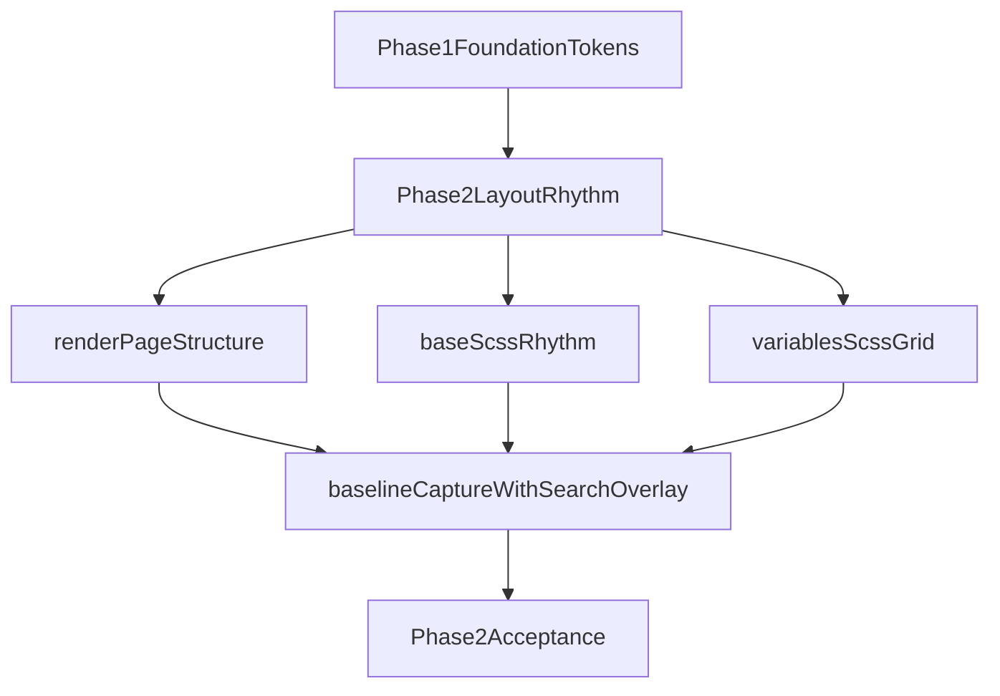

# Phase 2 — Layout & Rhythm

## Цель
Выстроить единый вертикальный ритм и контейнерную структуру (`header/content/footer`) без ухода в глубокую компонентную косметику (она остаётся для Phase 3), сохранив стабильный adaptive на `mobile/tablet/desktop`.

## Scope
- **Входит:** layout-уровень, глобальные отступы и ширины контейнеров, ритм между секциями, визуальная иерархия страниц.
- **Не входит:** унификация hover/focus/active для всех core-components (это [REDESIGN_SPEC.md](REDESIGN_SPEC.md), фаза 3), hero на главной (фаза 4).

## Ключевые файлы
- [REDESIGN_SPEC.md](REDESIGN_SPEC.md)
- [docs/redesign/phase-1-foundation.md](docs/redesign/phase-1-foundation.md)
- [quartz/components/renderPage.tsx](quartz/components/renderPage.tsx)
- [quartz.layout.ts](quartz.layout.ts)
- [quartz/styles/base.scss](quartz/styles/base.scss)
- [quartz/styles/variables.scss](quartz/styles/variables.scss)
- [quartz/styles/custom.scss](quartz/styles/custom.scss)
- [scripts/capture-baseline.mjs](scripts/capture-baseline.mjs)
- [docs/redesign/baseline/README.md](docs/redesign/baseline/README.md)
- [docs/redesign/phase-0-audit.md](docs/redesign/phase-0-audit.md)

## Технический подход

## Шаги реализации
1. Подтвердить актуальную композицию layout и области (`page-header`, `center/article`, `page-footer`) в [quartz/components/renderPage.tsx](quartz/components/renderPage.tsx) и [quartz.layout.ts](quartz.layout.ts), чтобы все ритм-изменения делались на корректных точках входа.
2. Нормализовать вертикальный ритм в [quartz/styles/base.scss](quartz/styles/base.scss):
   - интервалы между `header -> article -> footer`,
   - расстояния между секциями и заголовками,
   - поведение разделителя (`hr`) и нижних блоков.
3. Обновить сеточные/брейкпоинт-константы в [quartz/styles/variables.scss](quartz/styles/variables.scss) для согласованного spacing на `desktop/tablet/mobile` (без смены архитектуры Quartz).
4. Сверить, что изменения ритма опираются на token-layer из [quartz/styles/custom.scss](quartz/styles/custom.scss), не вводя новый конкурирующий набор переменных.
5. Выполнить smoke-проверку ключевых маршрутов (`/`, `/tags`, `/wishlist`, `/MermaidJS`) в обеих темах и трёх форм-факторах.
6. Обновить baseline-скрипт [scripts/capture-baseline.mjs](scripts/capture-baseline.mjs): добавить отдельный capture для состояния search overlay и переснять baseline-артефакты.
7. Обновить документацию baseline в [docs/redesign/baseline/README.md](docs/redesign/baseline/README.md) и зафиксировать в [docs/redesign/phase-0-audit.md](docs/redesign/phase-0-audit.md) соответствие Surface System (включая search overlay) к наборам скриншотов.
8. Прогнать проверки (`build/typecheck`) и записать краткий handoff-отчёт для перехода к Phase 3.

## Критерии готовности (DoD)
- Визуальная иерархия читается с первого взгляда на всех ключевых страницах.
- Нет заметных «провалов» ритма между header/content/footer и секциями article.
- Adaptive не деградирует на `mobile/tablet/desktop`.
- Baseline полностью переснят в `light/dark` с дополнительным кадром search overlay.
- Документация baseline и audit отражает новый охват поверхностей.

## Риски и контроль
- Локальные стили компонентов могут перебивать новый ритм: фиксируем только layout-уровень и минимальные точечные правки, без полного surface-polish.
- Избыточная правка `renderPage` может затронуть контентный поток: держим изменения структурно минимальными, акцент на CSS.
- Неполный baseline скрывает регрессии: search overlay фиксируется как обязательный артефакт в этом этапе.
