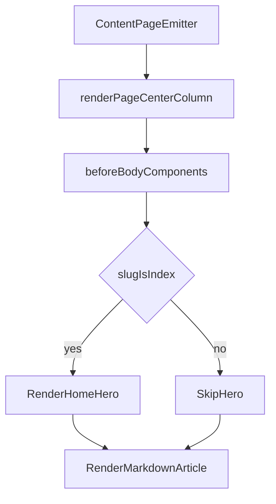

# План реализации Фазы 4 — Homepage Hero

## Цель фазы
- Добавить Hero-блок только для главной страницы (`slug: index`) в рамках текущего Quartz-layout.
- Сохранить существующий поток контента: Hero отображается перед markdown-контентом `content/index.md`, без потери и без дублирования рендера.
- Встроить Hero в уже унифицированный surface-язык (token-first, `border/radius/shadow`, единые интерактивные состояния).

## Scope
- **Входит:** компонент Hero, его стили, index-only логика показа, отступ Hero→article, smoke-проверка baseline-маршрутов.
- **Не входит:** новая архитектура layout Quartz, массовые правки контента заметок, полный accessibility-аудит (это Phase 5).

## Файлы в работе
- Спецификация и handoff:
  - [/home/lokhmatoff/Work/Personal/lokhmatoff.space/REDESIGN_SPEC.md](/home/lokhmatoff/Work/Personal/lokhmatoff.space/REDESIGN_SPEC.md)
  - [/home/lokhmatoff/Work/Personal/lokhmatoff.space/docs/redesign/phase-3-surface-unification.md](/home/lokhmatoff/Work/Personal/lokhmatoff.space/docs/redesign/phase-3-surface-unification.md)
- Точки интеграции layout/components:
  - [/home/lokhmatoff/Work/Personal/lokhmatoff.space/quartz.layout.ts](/home/lokhmatoff/Work/Personal/lokhmatoff.space/quartz.layout.ts)
  - [/home/lokhmatoff/Work/Personal/lokhmatoff.space/quartz/components/index.ts](/home/lokhmatoff/Work/Personal/lokhmatoff.space/quartz/components/index.ts)
  - [/home/lokhmatoff/Work/Personal/lokhmatoff.space/quartz/components/ArticleTitle.tsx](/home/lokhmatoff/Work/Personal/lokhmatoff.space/quartz/components/ArticleTitle.tsx)
  - [/home/lokhmatoff/Work/Personal/lokhmatoff.space/quartz/components/pages/Content.tsx](/home/lokhmatoff/Work/Personal/lokhmatoff.space/quartz/components/pages/Content.tsx)
- Новые артефакты фазы 4:
  - [/home/lokhmatoff/Work/Personal/lokhmatoff.space/quartz/components/HomeHero.tsx](/home/lokhmatoff/Work/Personal/lokhmatoff.space/quartz/components/HomeHero.tsx)
  - [/home/lokhmatoff/Work/Personal/lokhmatoff.space/quartz/components/styles/homeHero.scss](/home/lokhmatoff/Work/Personal/lokhmatoff.space/quartz/components/styles/homeHero.scss)
  - [/home/lokhmatoff/Work/Personal/lokhmatoff.space/docs/redesign/phase-4-homepage-hero.md](/home/lokhmatoff/Work/Personal/lokhmatoff.space/docs/redesign/phase-4-homepage-hero.md)

## Технический подход

## Шаги реализации
1. Создать `HomeHero` как отдельный Quartz-компонент с единым источником контента (title/description/CTA) внутри компонента/опций, чтобы не хардкодить текст в нескольких местах.
2. Подключить `HomeHero` в композицию layout через `beforeBody` (в `quartz.layout.ts`) и добавить index-only guard (`fileData.slug === "index"`) внутри самого компонента.
3. Применить для Hero surface-правила из Phase 3: `--bg-elevated`, `--border`, `--radius-*`, `--shadow-sm/md`, токенизированные hover/focus для CTA.
4. Проверить связность Hero с текущим заголовком страницы:
   - если `ArticleTitle` на главной создаёт визуальное дублирование заголовка, добавить index-only suppression для `ArticleTitle`;
   - если дублирования нет, оставить текущий поток без исключений.
5. Настроить вертикальный ритм между Hero и markdown-статьёй в глобальном/layout-слое без ad-hoc отступов в контенте `index.md`.
6. Прогнать проверку (`npx tsc --noEmit`, `npm run quartz -- build`) и baseline smoke-check (`/`, `/tags`, `/wishlist`, article, search overlay) в light/dark desktop/mobile.
7. Зафиксировать итог в `docs/redesign/phase-4-homepage-hero.md` с рисками и handoff в Phase 5.

## Критерии готовности (DoD)
- Hero отображается только на `index`, на остальных страницах отсутствует.
- Контент `content/index.md` рендерится полностью и единожды, сразу после Hero.
- На mobile Hero не перегружает первый экран (умеренная высота, компактные отступы, читаемый CTA).
- Hero визуально соответствует общей surface-системе Phase 1–3.
- Typecheck/build проходят, baseline smoke-check не показывает регрессий в ключевых сценариях.

## Риски и контроль
- Риск: дублирование H1 между Hero и `ArticleTitle` на главной.
  - Контроль: явная проверка index-сценария и index-only suppression `ArticleTitle` при необходимости.
- Риск: Hero визуально «выпадет» из unified surfaces.
  - Контроль: использовать только существующие токены и интерактивные паттерны, без phase-local палитры.
- Риск: чрезмерная высота Hero на mobile.
  - Контроль: ограничить spacing/typography в `homeHero.scss` отдельными mobile-правилами и проверить baseline-mobile.