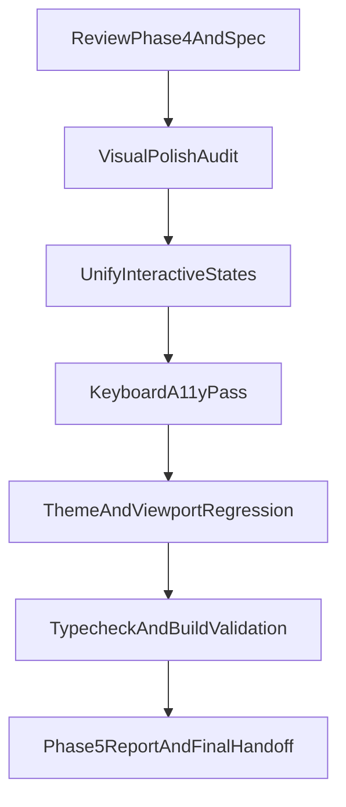

# План реализации Фазы 5 — Polish & Accessibility

## Цель фазы
- Завершить редизайн после фаз 0–4 финальной визуальной полировкой без изменения архитектуры.
- Убедиться, что интерактивные состояния предсказуемы и единообразны во всех ключевых поверхностях.
- Подтвердить, что клавиатурная навигация и читаемость не ухудшились относительно baseline.

## Scope
- **Входит:**
  - Точечный polish существующих интерфейсов: контраст, визуальная иерархия, ритм отступов, согласованность бордеров/фонов.
  - Проверка и выравнивание `hover` / `focus-visible` / `active` для ссылок, кнопок, чипов, поисковых контролов и элементов списков.
  - Клавиатурный a11y-проход (tab traversal, видимость фокуса, отсутствие «ловушек» фокуса) на ключевых маршрутах.
  - Финальная регрессионная проверка light/dark и mobile/desktop.
- **Не входит:**
  - Смена архитектуры Quartz или роутинга.
  - Массовая переработка контента заметок.
  - Новый функционал вне polish/a11y (переносится в отдельную фазу/итерацию).

## Ключевые источники и файлы
- Спецификация и предыдущие фазы:
  - [/home/lokhmatoff/Work/Personal/lokhmatoff.space/REDESIGN_SPEC.md](/home/lokhmatoff/Work/Personal/lokhmatoff.space/REDESIGN_SPEC.md)
  - [/home/lokhmatoff/Work/Personal/lokhmatoff.space/docs/redesign/phase-4-homepage-hero.md](/home/lokhmatoff/Work/Personal/lokhmatoff.space/docs/redesign/phase-4-homepage-hero.md)
  - [/home/lokhmatoff/Work/Personal/lokhmatoff.space/docs/redesign/phase-3-surface-unification.md](/home/lokhmatoff/Work/Personal/lokhmatoff.space/docs/redesign/phase-3-surface-unification.md)
- Основные точки внесения polish/a11y:
  - [/home/lokhmatoff/Work/Personal/lokhmatoff.space/quartz/styles/custom.scss](/home/lokhmatoff/Work/Personal/lokhmatoff.space/quartz/styles/custom.scss)
  - [/home/lokhmatoff/Work/Personal/lokhmatoff.space/quartz/styles/base.scss](/home/lokhmatoff/Work/Personal/lokhmatoff.space/quartz/styles/base.scss)
  - [/home/lokhmatoff/Work/Personal/lokhmatoff.space/quartz/styles/variables.scss](/home/lokhmatoff/Work/Personal/lokhmatoff.space/quartz/styles/variables.scss)
  - [/home/lokhmatoff/Work/Personal/lokhmatoff.space/quartz/components/](/home/lokhmatoff/Work/Personal/lokhmatoff.space/quartz/components/)
  - [/home/lokhmatoff/Work/Personal/lokhmatoff.space/quartz/components/styles/](/home/lokhmatoff/Work/Personal/lokhmatoff.space/quartz/components/styles/)
- Артефакт фазы 5:
  - [/home/lokhmatoff/Work/Personal/lokhmatoff.space/docs/redesign/phase-5-polish-accessibility.md](/home/lokhmatoff/Work/Personal/lokhmatoff.space/docs/redesign/phase-5-polish-accessibility.md)

## Технический подход

## Шаги реализации
1. Зафиксировать чеклист Phase 5 из спецификации и артефактов фаз 3–4: что считаем «визуальной несостыковкой» и где обязательно проверяем keyboard flow.
2. Провести целевой visual audit ключевых поверхностей (homepage hero + markdown поток, header, search, footer, листинги, теги, recent) и составить список точечных правок.
3. Выполнить polish-pass в стилях/компонентах с приоритетом на:
   - контраст и читаемость текста;
   - согласованность отступов и вертикального ритма;
   - унификацию бордеров/фонов/теней без «перетяжки» дизайна.
4. Уточнить интерактивные состояния и a11y:
   - проверить/добавить `:focus-visible` там, где его нет или он нечитабелен;
   - сверить hover/active/focus поведение между однотипными контролами;
   - проверить tab-навигацию и видимость фокуса на ключевых страницах.
5. Прогнать регрессии по темам и вьюпортам:
   - light/dark;
   - desktop/mobile;
   - маршруты smoke: `/`, `/tags`, `/archive`, 1–2 representative note pages.
6. Запустить обязательные проверки:
   - `npx tsc --noEmit`;
   - `npm run quartz -- build`.
7. Обновить отчёт фазы в `docs/redesign/phase-5-polish-accessibility.md`: список изменений, риски/ограничения, ручные проверки и итоговый handoff.

## Критерии готовности (DoD)
- Устранены заметные визуальные расхождения в ключевых интерфейсах.
- Для всех критичных интерактивных элементов есть предсказуемые `hover` / `focus-visible` / `active` состояния.
- Клавиатурная навигация (tab flow + фокус) не хуже baseline и не имеет явных регрессий.
- Читаемость (контраст, иерархия, плотность) не ухудшилась в light/dark.
- `npx tsc --noEmit` и `npm run quartz -- build` проходят успешно.
- Отчёт фазы 5 задокументирован, включая финальные риски и post-redesign рекомендации.

## Риски и контроль
- Риск: локальные стиль-переопределения в компонентах нарушат token-driven консистентность.
  - Контроль: правки сначала в общих стилях/переменных, затем точечные overrides в компонентах.
- Риск: улучшение focus-ring в одном месте ухудшит контраст в другой теме.
  - Контроль: обязательная парная проверка light/dark на каждом изменённом интерактивном паттерне.
- Риск: правки hero-области нарушат баланс первого экрана на mobile.
  - Контроль: отдельный mobile smoke на `/` с проверкой видимости hero + непрерывности markdown-контента.
- Риск: «косметические» изменения скроют функциональную регрессию.
  - Контроль: фиксированный smoke-маршрут + keyboard-only проход перед закрытием фазы.