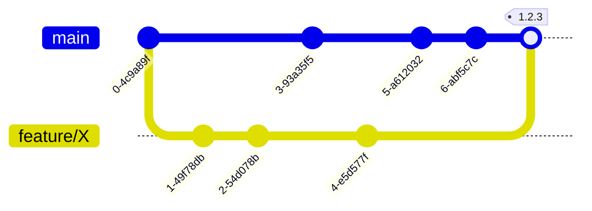

Данный тип диаграммы позволит нам отобразить модель ветвления в виде графа Git для любого репозитория на наше усмотрение. За большей информацией ты можешь обратиться к официальной документации.

- [Документация](https://mermaid.js.org/syntax/gitgraph.html)

## Пример диаграммы

В данном случае мы визуализируем модель **GitHub Flow**.

