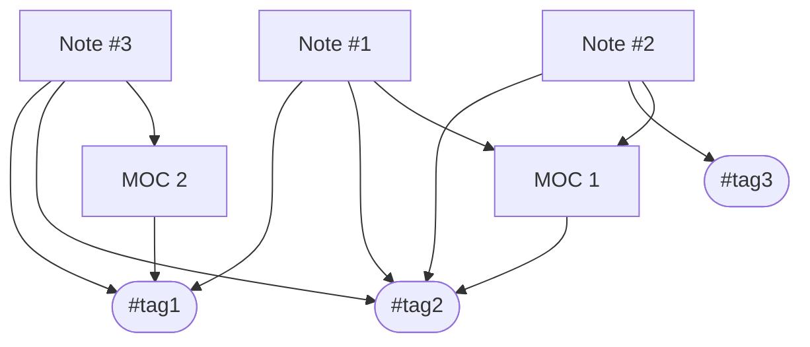

Когда мы пишем учебные, рабочие или другие заметки, мы часто думаем, как потом получить к ним доступ. Было придумано куча систем типа [[Zettelkasten]], [[PARA]] и так далее, все они служат различными способами для организации так называемого «второго мозга» (The Second Brain). Очень многие из них предлагают 2 взаимодополняемых способа группировки идей (заметок) — [[tags/|теги]] и [[Map of Content]] (aka *Карта контента*).

Однако возникает вопрос — чем отличается *тег* от *МОКа*. Каждый эксперт в *знаниеменеджменте* и/или в *ведении заметок* спокойно даст свой уникальный ответ. Я предложу свой:

1. ***Тегом*** может покрываться довольно таки широкая (порой глобальная) предметная область или область знаний. Например, ничто не помешает вести очерки о психоанализе и бихевиоризме, но все заметки помечать тегом `#psychology` — так можно явно обозначить сферу интереса автора. В науке тегом можно считать целую научную область, вроде *теоретической физики*, или такую более специализированную сущность, как *объект исследования* (например, мембраны из теории струн);
2. В качестве ***карты контента*** может выступать либо какой-то конкретный объект исследования/изучения/описания, концепт или даже предмет знания. Допустим, всё об *эволюции галактик* можно было бы линковать с соответствующим *МОКом*;
3. Промежуточным итогом является предлагаемая мной идея о возможности разделения *тега* и *МОКа* и одновременной их связью. Мы можем написать несколько заметок, прилинковать их к одному *МОКу*, при этом по разному затегировать их (но всё ещё можем затегировать наш *МОК*).

Как бы выглядела эта идея визуально:

